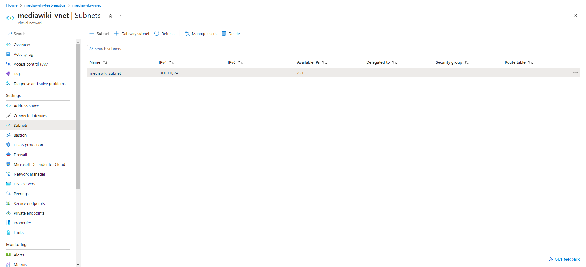

  

The code consists of Terraform examples using HashiCorp Configuration Language (HCL) on Microsoft Azure.  

There are 5 Modules. List of Modules are below :  

* <u> azure-rg</u> - Terraform code to deploy  Resource Group on Azure. 

* <u> azure-vnet</u> - Terraform code to deploy  Subnet on Azure.  

* <u> azure-subnet</u> - Terraform code to deploy  Virtual network on Azure. 
 

* <u> azure-acr</u> - Terraform code to deploy Azure Container Registry on Azure.  

* <u> azure-aks</u> - Terraform code to deploy Azure Kubernetes on Azure.  

Also Basic Pipeline has been Created using github workflow. 

After Running the Pipeline Azure Infra has been created  
Below are Lists

